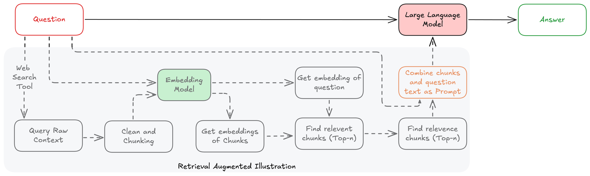

# RAG for Proteins



A demonstration of Retrieval-Augmented Generation (RAG) applied to protein analysis, currently focusing on antibody data from SAbDab (Structural Antibody Database).

## 🌟 Features

Current:
- RAG-powered chat interface for antibody structure analysis
- Integration with SAbDab for antibody structural data
- Local LLM support via Ollama (currently using Qwen 7B)
- Persistent vector storage for efficient retrieval
- Clean, modular architecture with separate components for:
  - Data loading and preprocessing
  - Vector storage management
  - LLM interface
  - RAG pipeline coordination
  - Streamlit UI

## 🚀 Quick Start

### Prerequisites

- Python 3.10+
- Ollama installed and running
- Required Python packages:
```bash
pip install -r requirements.txt
